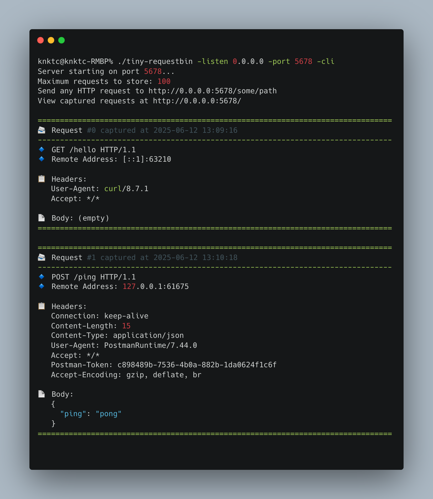
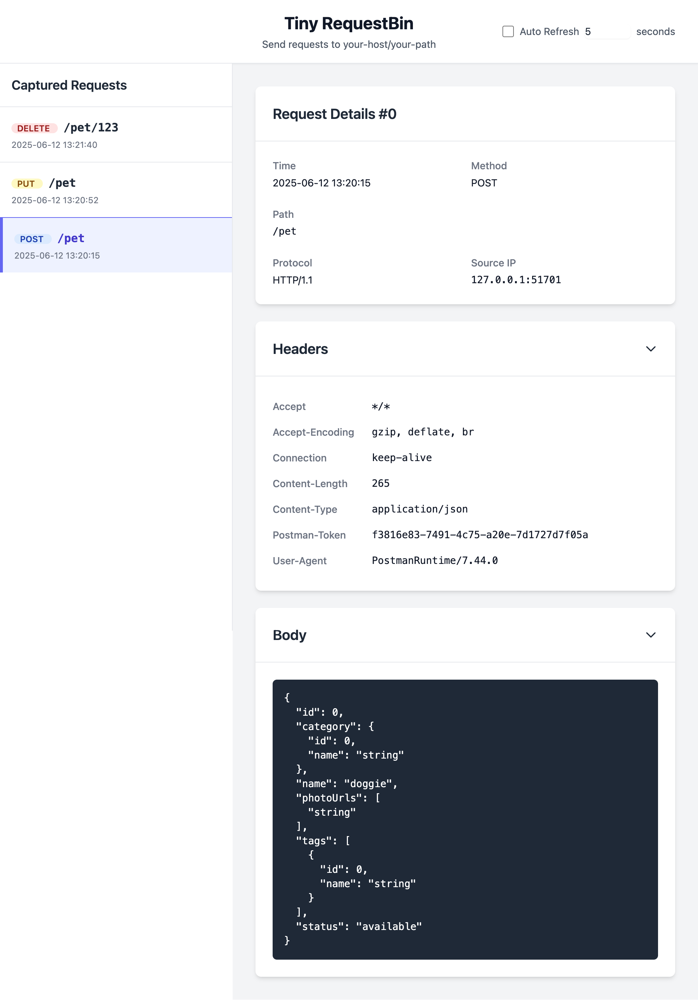

# Tiny RequestBin

*[English](README.md) | [简体中文](README_ZH_CN.md)*

A lightweight HTTP request inspector and debugging tool written in Go. Tiny RequestBin captures and displays HTTP requests for inspection and debugging purposes.

This project was initially created with Gemini and later modified with GitHub Copilot.

[](https://golang.org/)
[](LICENSE)

## Features

- 🚀 **Lightweight & Fast**: Simple implementation with minimal dependencies
- 🔍 **Request Inspection**: View detailed information about incoming HTTP requests
- 🌐 **Web UI**: Clean interface to browse captured requests
- 📋 **CLI Mode**: Option to print requests directly to the terminal
- 🔒 **Local Only**: All data stays on your machine, no external services needed

## Installation

### Option 1: Install using `go install`

```bash
go install github.com/knktc/tiny-requestbin@latest
```

### Option 2: Build from source

```bash
git clone https://github.com/knktc/tiny-requestbin.git
cd tiny-requestbin
go build
```

## Usage

Start the server with default options:

```bash
tiny-requestbin
```

### Command-line Options

- `-port`: Port for the server to listen on (default: 8080)
- `-listen`: Address to listen on (default: 127.0.0.1)
- `-max`: Maximum number of requests to store (default: 100)
- `-cli`: Enable CLI mode to print requests to terminal (default: false)

Example with custom options:

```bash
tiny-requestbin -port 9000 -listen 0.0.0.0 -max 1000 -cli
```

## How It Works

1. Start the server using one of the methods above
2. Send HTTP requests to `http://[listen-address]:[port]/any/path`
3. View captured requests in your browser at `http://[listen-address]:[port]/`
4. If CLI mode is enabled, requests will also be printed to the terminal

## Screenshots

### CLI Mode

When running with the `-cli` flag, HTTP requests are beautifully formatted and displayed directly in the terminal:



### Web Interface

The web interface provides a clean and intuitive way to browse and inspect captured requests:



## Contributing

Contributions are welcome! Feel free to submit a Pull Request.

## License

This project is licensed under the MIT License - see the [LICENSE](LICENSE) file for details.
