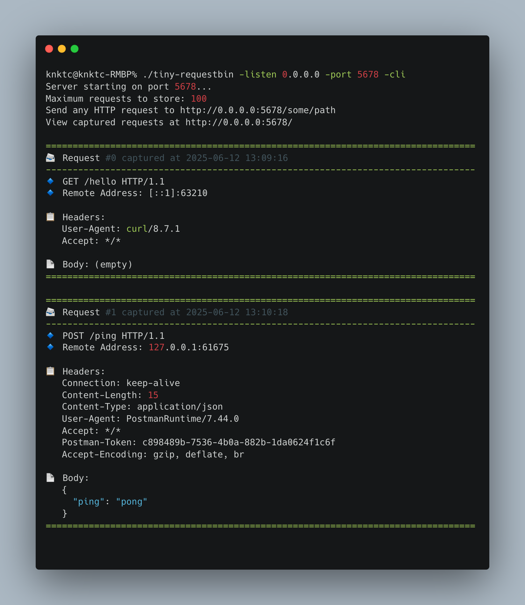
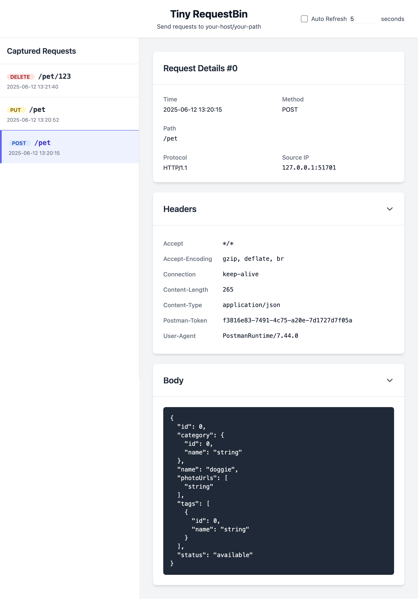

# Tiny RequestBin

*[English](README.md) | [简体中文](README_ZH_CN.md)*

Tiny RequestBin 是一个用 Go 语言编写的轻量级 HTTP 请求检查和调试工具。它可以捕获并显示 HTTP 请求，便于检查和调试。

本项目使用 Gemini 做了开局，后面使用 Github Copilot 进行修改。

[](https://golang.org/)
[](LICENSE)

## 特性

- 🚀 **轻量且快速**：简单实现，最小依赖
- 🔍 **请求检查**：查看传入的 HTTP 请求的详细信息
- 🌐 **Web 界面**：干净的界面浏览捕获的请求
- 📋 **CLI 模式**：可选择直接在终端打印请求
- 🔒 **本地运行**：所有数据都保留在您的机器上，无需外部服务

## 安装

### 方式一：使用 `go install` 安装

```bash
go install github.com/knktc/tiny-requestbin@latest
```

### 方式二：从源码构建

```bash
git clone https://github.com/knktc/tiny-requestbin.git
cd tiny-requestbin
go build
```

## 使用方法

使用默认选项启动服务器：

```bash
tiny-requestbin
```

### 命令行选项

- `-port`：服务器监听的端口（默认：8080）
- `-listen`：服务器监听的地址（默认：127.0.0.1）
- `-max`：最大存储的请求数量（默认：100）
- `-cli`：启用 CLI 模式，在终端打印请求（默认：false）

自定义选项示例：

```bash
tiny-requestbin -port 9000 -listen 0.0.0.0 -max 1000 -cli
```

## 工作原理

1. 使用上述方法之一启动服务器
2. 向 `http://[监听地址]:[端口]/任意/路径` 发送 HTTP 请求
3. 在浏览器中访问 `http://[监听地址]:[端口]/` 查看捕获的请求
4. 如果启用了 CLI 模式，请求也会打印到终端

## 截图

### CLI 模式

当使用 `-cli` 参数运行时，HTTP 请求会以美观的格式直接显示在终端中：



### Web 界面

Web 界面提供了一个简洁直观的方式来浏览和检查捕获的请求：



## 贡献

欢迎贡献！请随时提交 Pull Request。

## 许可证

该项目采用 MIT 许可证 - 详情请参见 [LICENSE](LICENSE) 文件。
